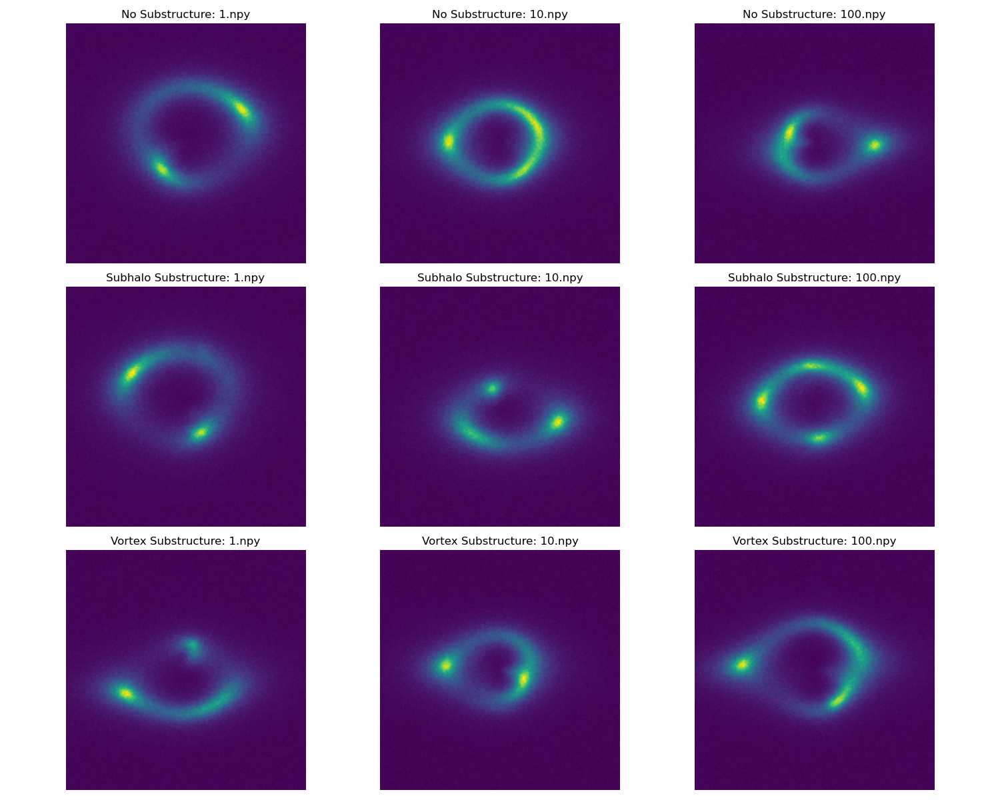
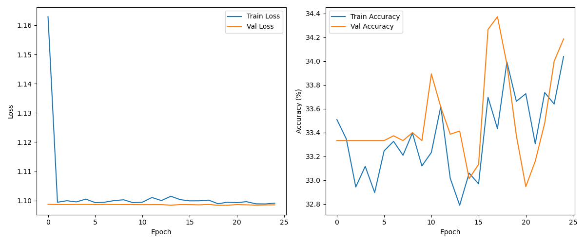
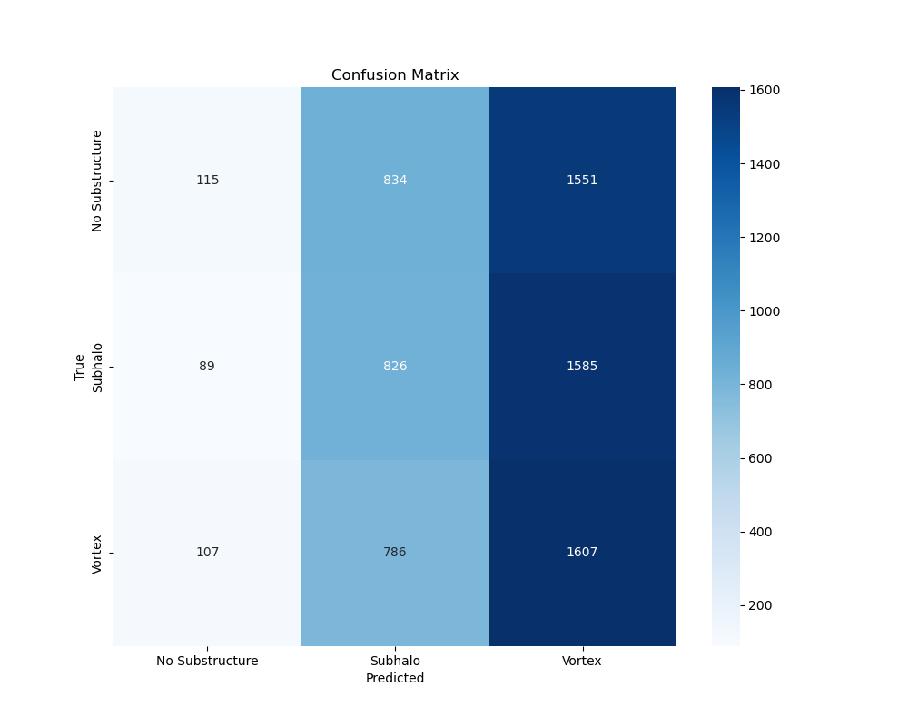
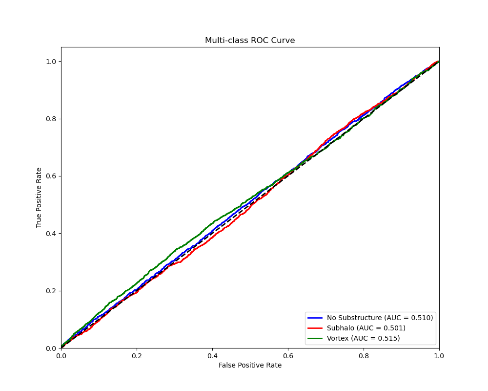
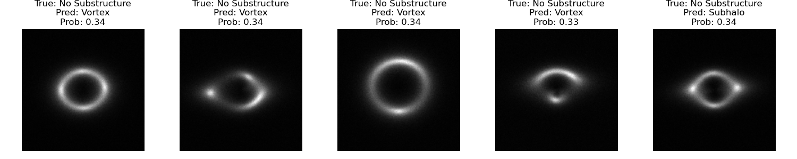
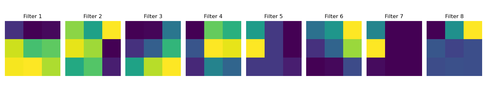

# Multi-Class Image Classification for Strong Gravitational Lensing Substructure Detection


## Results

The model's performance was evaluated on the validation dataset using several metrics, including a classification report, ROC curve, and AUC score. Key results are summarized below and visualized in the subsequent figures.

**Classification Report:**

```
                 precision    recall  f1-score   support

No Substructure       0.37      0.05      0.08      2500
        Subhalo       0.34      0.33      0.33      2500
         Vortex       0.34      0.64      0.44      2500

       accuracy                           0.34      7500
      macro avg       0.35      0.34      0.29      7500
   weighted avg       0.35      0.34      0.29      7500
```

**Weighted AUC Score:** 0.5086
**Class AUC Scores:** No Substructure: 0.5095, Subhalo: 0.5011, Vortex: 0.5152

---

### Visualizations

**Figure 1: Sample Images**

*Sample images from the dataset, showcasing examples of 'no substructure', 'sphere', and 'vort' classes.*

**Figure 2: Training History**

*Training history of the model, showing the training and validation loss and accuracy curves over 25 epochs.*

**Figure 3: Confusion Matrix**

*Confusion Matrix visualizing the performance of the multi-class classification model on the validation dataset.*

**Figure 4: ROC Curve**

*Receiver Operating Characteristic (ROC) curve for the multi-class classification, demonstrating the model's ability to distinguish between classes.*

**Figure 5: Sample Predictions**

*Sample images from the validation set with overlaid model predictions, illustrating the model's classification performance on individual examples.*

**Figure 6: Layer 0 Filters**

*Visualization of the filters learned in the first convolutional layer of the model.*


