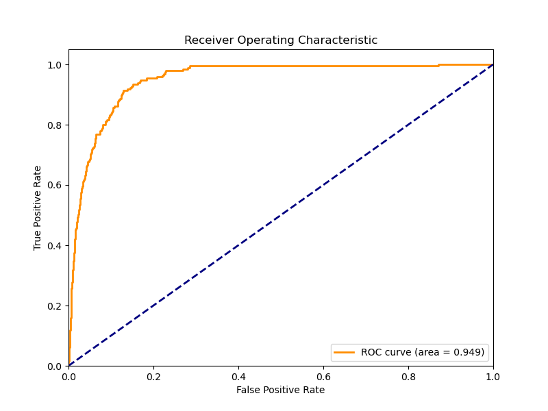

# Gravitational Lensing Classification Results

## Visualizations

### Sample Images

*Training dataset samples: lensed galaxies (top) and non-lensed galaxies (bottom).*

### Training History

*Left: Training and validation loss. Right: Training and validation accuracy.*

### Sample Predictions

*Model predictions on test samples showing true labels, predicted labels, and confidence scores.*

### ROC Curve

*ROC curve showing model performance with Area Under Curve (AUC) score.*

### Confusion Matrix

*Confusion matrix showing true positive, true negative, false positive, and false negative counts.*